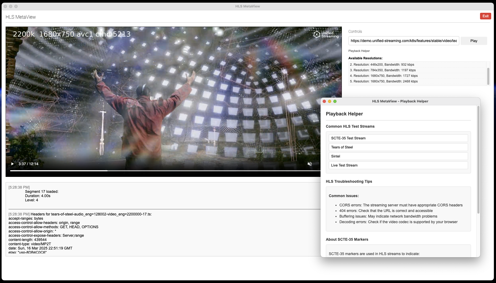

# HLS MetaView

HLS MetaView is a Chrome extension that allows you to analyze and play HLS (HTTP Live Streaming) video streams with real-time metadata extraction, visualization, and administrative configuration.



## Features

- Play HLS video streams directly in the extension
- View real-time metadata from master and media playlists
- Detect and highlight SCTE-35 markers for ad insertion points
- Display available video resolutions and bitrates
- Monitor HTTP headers from segment requests
- Track buffer status and playback health
- Support for multiple instances and quick-access to test streams
- Admin panel for configuration (AI key, JSON settings)

## Installation

### From Built Source (Recommended)

1.  **Clone or Download:** Get the source code from this repository.
    ```bash
    git clone https://github.com/arterberry/hls-metaviewl
    cd hls-metaview
    ```
2.  **Install Dependencies:** Make sure you have Node.js and npm installed. Then run:
    ```bash
    npm install
    ```
3.  **Build the Extension:** Run the build script. This will compile necessary files and place them in the `dist` folder. It also runs tests.
    ```bash
    ./build.sh
    ```
    *(If the build fails on tests, ensure dependencies are installed correctly (`npm install`) or check test configurations.)*
4.  **Load into Chrome:**
    *   Open Chrome and navigate to `chrome://extensions/`.
    *   Enable "Developer mode" using the toggle switch, usually in the top-right corner.
    *   Click the "Load unpacked" button.
    *   Navigate to and select the `dist` folder **inside** your `hls-metaview` project directory.
5.  **Ready:** The HLS MetaView extension icon should appear in your Chrome toolbar.

## Usage

1.  Click the HLS MetaView icon in your Chrome toolbar to open the extension popup.
2.  Enter an HLS URL in the input field (must end with `.m3u8`).
3.  Click "Play" to load and play the stream.
4.  View metadata, resolutions, and other information in the panels.
5.  Use the "Playback Helper" link for quick access to test streams.
6.  Access the Admin Panel via the extension's options or a designated link to configure settings (IN PROGRESS).

## Playback Helper

The Playback Helper provides:
- Quick access to common HLS test streams
- Troubleshooting tips for common HLS playback issues
- Information about SCTE-35 markers

## Development

### Project Structure

```
hls-metaview/
├── background.js        # Background service worker
├── helper.html          # Playback helper popup
├── helper.js            # Helper popup 
├── explainer.js         # Explainer popup 
├── hls.min.js           # HLS.js library
├── html2canvas.min.js   # HTML2Canvas library
├── manifest.json        # Extension manifest
├── metadata.js          # Metadata 
├── qoe.js               # QoE functions
├── popup.html           # Main extension interface
├── popup.js             # Main functionality
└── styles.css           # Extension styling
```

### Base Functionality

- **HLS.js Integration**: The extension uses HLS.js for playback with custom configuration for improved buffer management.
- **Metadata Extraction**: Real-time parsing of manifests and segments for metadata.
- **Header Capture**: Custom loader to capture HTTP response headers.
- **Buffer Monitoring**: Tracking of buffer state with visual indicators.
- **SCTE-35 Detection**: Parsing playlists for SCTE-35 ad markers.

## Technical Details

### How It Works

1. The extension loads the HLS stream using HLS.js
2. It intercepts manifest and segment requests to extract metadata
3. Playback is monitored for buffer health and errors
4. Metadata is displayed in real-time in the interface

### Key Components

- **Custom Loader**: Extends HLS.js default loader to capture HTTP headers
- **Manifest Parser**: Extracts resolution, bitrate, and SCTE-35 markers
- **Buffer Monitor**: Tracks video element buffer state
- **Error Handler**: Detects and displays HLS.js errors with recovery options

## Troubleshooting

- **CORS Errors**: Make sure your HLS streams have appropriate CORS headers
- **404 Errors**: Verify that the stream URL is correct and accessible
- **Buffering Issues**: Check your network connection or try a lower resolution
- **Playback Errors**: Some streams may use codecs not supported by Chrome

## License

This project is licensed under the GNU General Public License v3.0 - see the [LICENSE](https://www.gnu.org/licenses/gpl-3.0.en.html#license-text) file for details.  